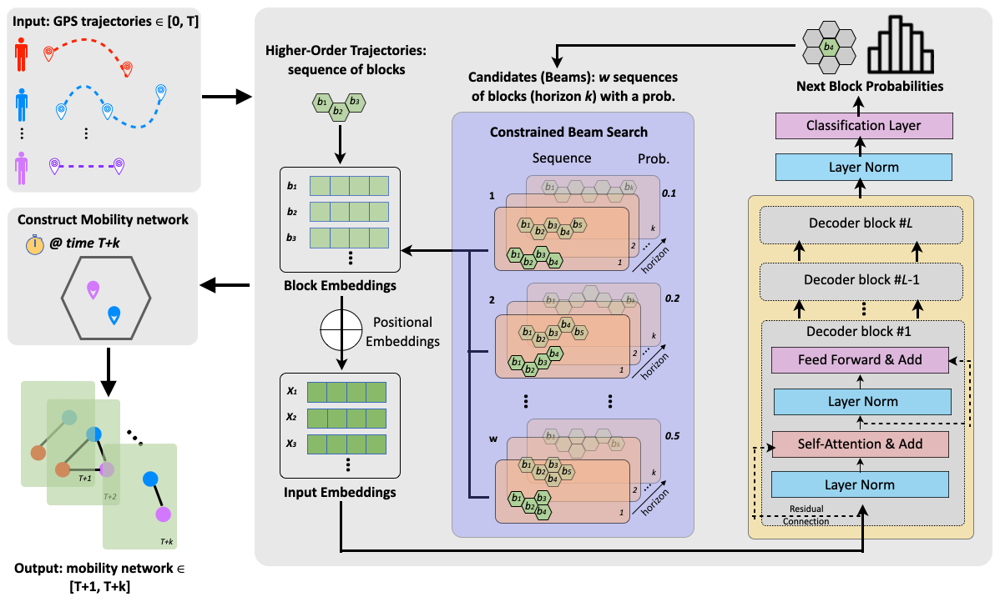

# MobiNetForecast: A Trajectory-based Contact Prediction Approach

## Overview

MobiNetForecast is a **Transformer‑driven framework** that first forecasts individual trajectories and then infers future “contacts” (spatial collisions) among moving objects.
It was designed with public‑health, mobility, and crowd‑safety scenarios in mind, where both **minute‑level warnings** and **week‑ahead planning** matter.

<p align="center">
  
</p>

## Getting Started

### Prerequisites

- This implementation requires **Python version `>= 3.10`**.
- Ensure you have a compatible Python environment. Refer to `environment.yml` for the required packages.

### Step-by-Step Instructions

0. **Clone the Repository**

   Clone the project on your computer:
     ```bash
     git clone https://github.com/amir-ni/MobiNetForecast.git
     ```

1. **Download and Pre-process the Datasets**:

   Run the script to download the datasets. You can specify the datasets by passing them as arguments (`geolife` or `sfco`). For example:
     ```bash
     python3 ./data_downloader.py sfco
     ```

   To see all the accepted arguments (including changes to data directory and resolution), please use the following command:
     ```bash
     python3 data_downloader.py --help
     ```

2. **Set Up the Model Configuration**:

   The configuration of the model, such as batch size, learning rates, and dataset-specific settings, can be passed as to model as a `yaml` configuration file. This file can also include multiple configurations and will train separate models sequentially. An example configuration used for generating results provided in the paper can be found in `config.yaml`.

   You can create/modify this file according to your needs. Some configurations are described below and additional configurations can be found in the end of this document.
     - **`data_dir`**: Directory where the dataset is stored. If you have not changed the default output directory in the previous steps, the address would be `./data`.
     - **`dataset`**: Name of the dataset being used, such as `sfco`.
     - **`model_checkpoint_directory`**: Directory path where model checkpoints will be saved during training.

   After modifying these parameters as per your requirements, save it in a `yaml` file. This file will be used during training and testing to control model behavior.

3. **Train the Model**:

   After configuring the model, you can start the training process. Use the following command:
    ```bash
    python3 main.py sfco.yaml
    ```

   This will train the model using the parameters specified in the `sfco.yaml` file. You can change it to your desired `yaml` file.

4. **Evaluate the Model**:

   Once the model is trained, you can evaluate its performance by running:
    ```bash
    python3 main.py sfco.yaml --test
    ```

   This will evaluate the trained model on the test part of the dataset.


### Additional Configuration Options:

- **`validation_ratio`**: Proportion of the dataset used for validation. For example, a value of `0.1` means 10% of the dataset will be used for validation.
- **`delimiter`**: The character that separates values in your dataset files (default is `" "`).
- **`batch_size`**: The number of samples processed together in one forward/backward pass.
- **`device`**: The computational device to use for training and testing. Set to `cuda` for GPU acceleration or `cpu` if no GPU is available.
- **`max_epochs`**: The maximum number of training epochs, where one epoch means a complete pass through the entire dataset.
- **`block_size`**: Block size used for processing sequences. Defines the length of the sequence chunks used during training and testing.
- **`learning_rate`**: Initial learning rate for the optimizer. Adjust this to control how fast the model learns.
- **`weight_decay`**: Regularization term to avoid overfitting by penalizing large weights. Higher values provide stronger regularization.
- **`beta1`**: Beta1 hyperparameter for the Adam optimizer, which controls the decay rate for the first moment estimate.
- **`beta2`**: Beta2 hyperparameter for the Adam optimizer, controlling the decay rate for the second moment estimate.
- **`grad_clip`**: Threshold for gradient clipping. Gradients that exceed this value will be clipped to prevent exploding gradients.
- **`decay_lr`**: Boolean flag to indicate whether the learning rate should be decayed over time.
- **`warmup_iters`**: Number of iterations during which the learning rate will increase from a small value to the initial learning rate (used in learning rate scheduling).
- **`lr_decay_epochs`**: Number of iterations over which the learning rate decays.
- **`min_lr`**: Minimum learning rate after decay. The learning rate will not decrease below this value.
- **`seed`**: Random seed for reproducibility. Ensures that experiments can be replicated with the same results.
- **`n_layer`**: Number of layers in the transformer model. More layers can increase model capacity but also computational cost.
- **`n_head`**: Number of attention heads in the transformer model, which allows the model to focus on different parts of the input sequence simultaneously.
- **`n_embd`**: Dimensionality of the embedding space. This represents the size of the vector representations for each token in the input sequence.
- **`bias`**: Boolean flag to indicate whether to include bias terms in the model's layers. Set to `False` to exclude bias.
- **`dropout`**: Dropout rate used for regularization. A value of `0` means no dropout will be applied.
- **`custom_initialization`**: A boolean flag that specifies whether to use a axial coordination based initialization for the model's training.
- **`train_from_checkpoint_if_exist`**: A boolean flag that indicates whether to resume training from an existing checkpoint if one is found.
- **`patience`**: Integer value indicating the number of epochs to wait for before early stopping.
- **`continuity`**: Boolean flag to enforce spatial continuity constraints on predictions.
- **`beam_width`**: Integer specifying the beam width for beam search.
- **`store_predictions`**: Boolean flag to enable or disable storing the predicted sequences.
- **`resolution`**: Spatial discretization resolution. Defines the granularity of the input space (e.g., number of grid cells per unit distance).
- **`window_size`**: Temporal window size (in seconds) used for segmenting trajectories into fixed-length chunks.
- **`min_input_length`**: The minimum length of input sequences used during training and testing.
- **`max_input_length`**: The maximum length of input sequences allowed for model training.
- **`test_prediction_length`**: The number of future steps the model will predict during testing.

## License

This project is open-source software licensed under the [LICENSE](LICENSE).

## Citation

If you use this project or MobiNetForecast in your research, please consider citing it as follows:

```tex
@inproceedings{
}
```